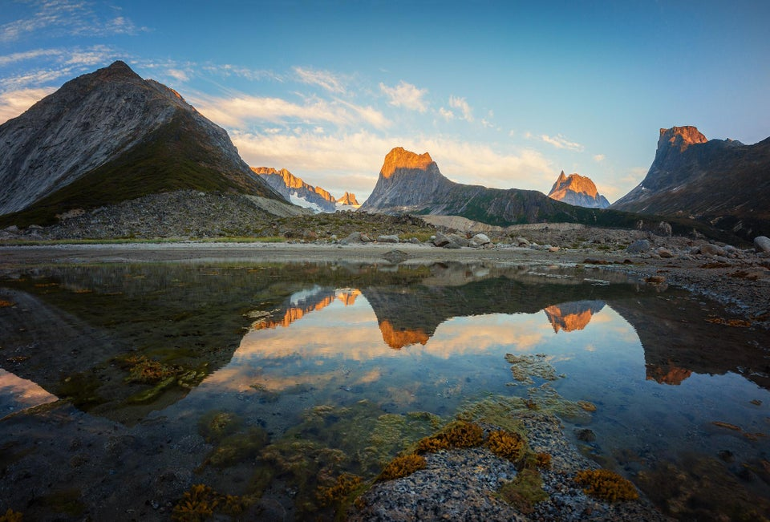

# **Greenland**
## Chill out with a trip!

---

## Why should you visit us?
 Greenland, the home of cold nights, beautiful lights, serene stars, breath-taking views and life changing experiences. From the Northen Lights to the cool calming presence, experience Greenland for yourself. 

Want to come and see for yourself?

[Book Now!](https://www.expedia.co.uk/Nuuk.d1359.Holidays-City-Breaks)

---

## Still not tempted? Here's what some of our explorers have said!
- "It might be cold, but it sure is worth it!" - Mr G. Land
- "Absolutely stunning, I'll definitely bring the dog next time." - Mrs I. Amcold
- "Very snowy" - Ms F. Rozen

---

## Find things to do

### Hotels
1. [Hotel A](https://www.expedia.co.uk/SCH-731-1294232-1461894.h33701872.Hotel-Information?chkin=11%2F7%2F2019&chkout=12%2F7%2F2019&regionId=1359&destination=Nuuk%2C+Sermersooq%2C+Greenland&swpToggleOn=true&rm1=a2&x_pwa=1&sort=recommended&top_dp=5&top_cur=GBP&rfrr=HSR&pwa_ts=1561476437440&hasClusterProp=false)
2. [Hotel B](https://www.expedia.co.uk/The-Blue-Guesthouse-by-Greenland-Escape.h21393525.Hotel-Information?chkin=11%2F7%2F2019&chkout=12%2F7%2F2019&regionId=1359&destination=Nuuk%2C+Sermersooq%2C+Greenland&swpToggleOn=true&rm1=a2&x_pwa=1&sort=recommended&top_dp=77&top_cur=GBP&rfrr=HSR&pwa_ts=1561476506654&hasClusterProp=false)
3. [Hotel C](https://www.expedia.co.uk/PPB-Property-on-Vrboppb-Property-on-Vrboppb-Property-on-Vrboppb-Property-on-Vrbo.h21623614.Hotel-Information?chkin=11%2F7%2F2019&chkout=12%2F7%2F2019&regionId=1359&destination=Nuuk%2C+Sermersooq%2C+Greenland&swpToggleOn=true&rm1=a2&x_pwa=1&sort=recommended&rfrr=HSR&pwa_ts=1561476506656&hasClusterProp=false)

### Excursions
1. [Excursion A](www.google.com)
2. [Excursion B](www.google.com)
3. [Excursion C](www.google.com)

---

## Can't convince you with Hotels and Offers?
### Here are some facts, maybe this'll twist your mind

- Greenland is the size of Western Europe
- Around 80% of Greenland is covered by a huge ice cap
- The population is spread out over the country, across beautiful fjords and gorges

[Want more facts? Learn more](https://en.wikipedia.org/wiki/Nuuk) 

Become an explorer, travel anywhere and everywhere, achieve anything. Greenland. Land of experiences. Land of beauty. Land of cold.

[Book Now!](https://www.expedia.co.uk/Nuuk.d1359.Holidays-City-Breaks)

---

## Greenland too cold?
### Keep warm with our sponsor's Explore-a-Coat!

---

## Get in touch
- [Instagram:](www.google.com)
- [Facebook:](www.google.com)
- [Email:](www.google.com)
- [Tel:](www.google.com)

